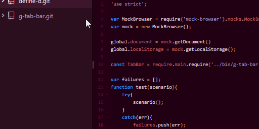

# Scripts in Atom
This package allow you to bind javascript functions to commands (`Ctrl-Shift-P`) and key bindings just by writing those in a file.

## How To
In the root of a specific the desired project, create a file named `scripts.js`. In this file, you will code the functions related to the this very project root, thus not binding them to stranger files.



## Scripts File
Each scripts file must be a node module exporting an array of objects with the following properties:

- **name:** Contains a string command name in lower case, dash separated words format. Ex.: 'build'; This will be used to identify the script.
- **match:** Contains a string with a regex pattern. Eg.: `'^index\\.js$'`; This will filter the files allowed to run the script.
- **hotkey:** Contains a [key combination string][1] in the atom default pattern. Eg.: `'ctrl-f9'`; This will be the registered key binding for the script.
- **script:** Contains the actual script as a function. The function will receive a `data` argument whose members provide a few utilities:
    - `file`: A string containing the active file path.
    - `project`: A string containing the active project root path.
    - `exec`: The `child_process` [function][2] for executing shell commands.

So we end up with the following file `scripts.js`.

```javascript
module.exports = [
    {
        name: 'build',
        match: '^index\\.js$',
        hotkey: 'ctrl-f9',
        script: (data) => {
            // Your code here...
        }
    },

    {
        name: 'debug',
        match: '^.*\\.js$',
        hotkey: 'ctrl-f8',
        script: (data) => {
            // Your code here.
        }
    }
]
```

## Contributing
For bug reporting, feature requesting and any issues, please refer to our [active GitLab repo](https://gitlab.com/guillitem/atom-scripts). Enjoy scripting!

[1]: http://flight-manual.atom.io/behind-atom/sections/keymaps-in-depth/#key-combinations
[2]: https://nodejs.org/api/child_process.html#child_process_child_process_exec_command_options_callback
